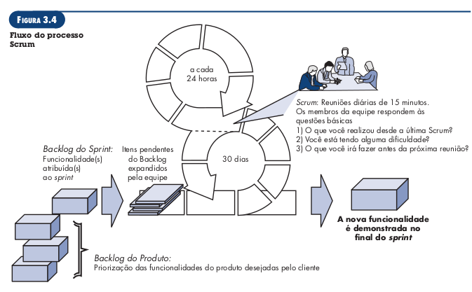

# Lista de exercícios - Modelagem ágil de requisitos

1. O que os princípios de desenvolvimento Ágil prioriza?

   - Indivíduos e interações acima de processos e ferramentas;
   - Software operacional acima de documentação completa;
   - Colaboração dos clientes acima de negociação contratual;
   - Respostas a mudanças acima de seguir um plano.

2. Por que o desenvolvimento Ágil é importante?

    Os métodos ágeis visam sanar fraquezas reais e perceptíveis da engenharia de software convencional, mas não é indicado para todos os projetos, produtos, pessoas e situações. Tampouco é a antítese da prática de engenharia de software consistente e pode ser aplicado como uma filosofia geral para os trabalhos de software.

    O desenvolvimento ágil é importante por fornecer uma alternativa à engenharia convencional mais adaptada ao ambiente mais moderno de sistemas, que é mais acelerado e está em constante mudança. Essa metodologia tem se mostrado capaz de entregar sistemas corretos rapidamente.

3. Quais são as etapas envolvidas desenvolvimento Ágil?

    As etapas de comunicação, planejamento, modelagem, construção e emprego, mas na forma de tarefas mínimas que impulsionam a equipe para o desenvolvimento e para a entrega.

4. Como garantir que o trabalho do desenvolvimento Ágil foi realizado corretamente?

    O trabalho está correto quando a equipe ágil concorda que o processo funciona e produz incrementos de software passíveis de entrega, que satisfazem o cliente.

5. O que é Scrum?

    É um método de desenvolvimento ágil de software, que foi concebido no início dos anos 1990. Os seus princípios são consistentes com o manifesto ágil, e seu processo engloba as atividades de: requisitos, análise, projeto, evolução e entrega.

6. O que são Backlog e Sprints?

    O _backlog_ é uma lista com prioridades dos requisitos ou funcionalidades do projeto que fornecem valor comercial ao cliente. Os itens podem ser adicionados ao backlog a qualquer momento do projeto.

    As _sprints_  são unidades de trabalho solicitadas para atingir um requisito estabelecido no _backlog_ e que precisa ser ajustado dentro de uma janela de tempo.

    Alterações não são introduzidas durante execução de _sprints_, o que permite que os membros de uma equipe trabalhem de forma estável.

    

7. O que é Backlog do Produto (Product Backlog) e Backlog do Sprint (Sprint Backlog)?

    O backlog do produto é a priorização das funcionalidades do projeto, desejadas pelo cliente. O backlog da sprint é o conjunto de atividades atribuídas à sprint.

8. O que são Reuniões Scrum, Scrum Master e Product Owner?

    Reuniões Scrum são reuniões curtas, tipicamente de 15 minutos, realizadas diariamente pela equipe Scrum, durante a qual três perguntas chave são respondidas por todos os membros da equipe:
        - O que você realizou desde a última reunião de equipe?
        - Quais obstáculos está encontrando?
        - O que planeja realizar até a próxima reunião da equipe?
    Scrum master é um líder de equipe, que conduz a reunião scrum e avalia as respostas e cada integrante.

    O product owner define os itens que compõem o backlog, faz a priorização destes e descreve-os para a equipe.

9. Defina uma persona do Product Owner do seu projeto da disciplina.

10. O que são histórias de usuários (User Stories)? Qual a estrutura que elas devem ser escritas?

11. Apresente dois exemplos de histórias de usuários (User Stories)?

12. Qual a diferença entre Tema, Épico e histórias de usuários (User Stories)? Forneça um exemplo.
