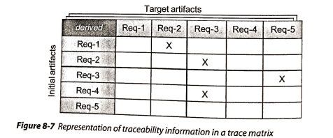
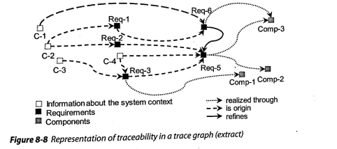

## Parte 1

Baseado no livro Requirements Engineering Fundamentals: A Study Guide for the Certified Professional for Requirements Engineering Exam - Foundation Level - IREB compliant do Klaus Pohl e Chris Rupp, responda as seguintes questões:

<ol>

<li> O que é Rastreabilidade (traceability)? </li>

The traceability of a requirement is the ability to trace the requirements over the course of the entire life cycle of the system.

<li> Escreva sobre as vantagens de requisitos rastreáveis. </li>

- Verifiability
- Identification of gold-plated solutions in the system
- Identification of gold-plated solutions in the requirements
- Impact analysis
- Reuse
- Accountability
- Maintenance

<li> Quais são tipos de rastreabilidade </li>

- Pre-RS traceability: traceability links between requirements and those artifacts and those artifacts that are **the basis** for the requirements, e.g., artifacts like the source or origin of a requirement (previous artifacts).
- Post-RS traceability: comprises traceability information between requirements and artifacts of **subsequent** development activities.
- Traceability between requirements: it's about mapping dependencies between requirements. And example is the information that a requirement refines other requirement, generalizes ir, or replaces it.

<li> Escreve sobre a representação da rastreabilidade de  </li>
requisitos.

- Text-based references and hyperlinks

- Trace matrices

- Trace graphs

<li> Escreva sobre versionamento de requisitos. </li>

</ol>

## Parte 2

Baseado no texto “Introducing Rich Pictures” do CTEC2402 - Software Development Project, responda as seguintes questões:

<ol>

<li> O que é Rich Picture? </li>

<li> Como se desenha um Rich Picture? </li>

<li> Quais são os 5 componentes que devem conter em um Rich
Picture? Explique cada um deles.</li>

1. Atores
2. Operações
3. Armazenamento dos dados
4. Setas (fluxos)
5. Fronteira

<li> Apresente uma abordagem para desenhar Rich Picture
orientada a negócios (business-related)? </li>

<li> Baseado no exemplo do Rich Picture do Book Shop (página 5),
apresente quais são os atores,as operações, os armazenamento de dados, setas fluxos e o que está e não está incluído dentro da fronteira do sistema. </li>
</ol>
