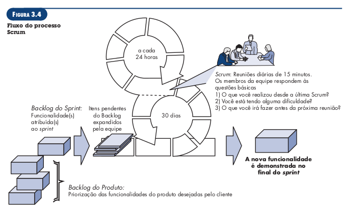

# Modelagem ágil de requisitos

## Lista de exercícios

### 1. O que os princípios de desenvolvimento Ágil prioriza?

- Indivíduos e interações acima de processos e ferramentas.
- Software operacional acima de documentação completa.
- Colaboração dos clientes acima de negociação contratual.
- Respostas a mudanças acima de seguir um plano.

Fonte: [1]

### 2. Por que o desenvolvimento Ágil é importante?

Os métodos ágeis visam sanar fraquezas reais e perceptíveis da engenharia de software convencional, mas não é indicado para todos os projetos, produtos, pessoas e situações. Tampouco é a antítese da prática de engenharia de software consistente e pode ser aplicado como uma filosofia geral para os trabalhos de software.

O desenvolvimento ágil é importante por fornecer uma alternativa à engenharia convencional mais adaptada ao ambiente mais moderno de sistemas, que é mais acelerado e está em constante mudança. Essa metodologia tem se mostrado capaz de entregar sistemas corretos rapidamente.

Fonte: [1]

### 3. Quais são as etapas envolvidas desenvolvimento Ágil?

As etapas de comunicação, planejamento, modelagem, construção e emprego, mas na forma de tarefas mínimas que impulsionam a equipe para o desenvolvimento e para a entrega.

Fonte: [1]

### 4. Como garantir que o trabalho do desenvolvimento Ágil foi realizado corretamente?

O trabalho está correto quando a equipe ágil concorda que o processo funciona e produz incrementos de software passíveis de entrega, que satisfazem o cliente.

Fonte: [1]

### 5. O que é Scrum?

É um método de desenvolvimento ágil de software, que foi concebido no início dos anos 1990. Os seus princípios são consistentes com o manifesto ágil, e seu processo engloba as atividades de: requisitos, análise, projeto, evolução e entrega

Fonte: [1]

### 6. O que são Backlog e Sprints?

O _backlog_ é uma lista com prioridades dos requisitos ou funcionalidades do projeto que fornecem valor
comercial ao cliente. Os itens podem ser adicionados ao backlog a qualquer momento do projeto.

As _sprints_  são unidades de trabalho solicitadas para atingir um requisito estabelecido no _backlog_ e que precisa ser ajustado dentro de uma janela de tempo.

Alterações não são introduzidas durante execução de _sprints_, o que permite que os membros de uma equipe trabalhem de forma estável.

Figura 1: Fluxo do processo Scrum.  Fonte: [1]

Fonte: [1]

### 7. O que é Backlog do Produto (Product Backlog) e Backlog do Sprint (Sprint Backlog)?

O backlog do produto é a priorização das funcionalidades do projeto, desejadas pelo cliente. O backlog da sprint é o conjunto de atividades atribuídas à sprint.

Fonte: [1]

### 8. O que são Reuniões Scrum, Scrum Master e Product Owner?

Reuniões Scrum são reuniões curtas, tipicamente de 15 minutos, realizadas diariamente pela equipe Scrum, durante a qual três perguntas chave são respondidas por todos os membros da equipe:

- O que você realizou desde a última reunião de equipe?
- Quais obstáculos está encontrando?
- O que planeja realizar até a próxima reunião da equipe?
Scrum master é um líder de equipe, que conduz a reunião scrum e avalia as respostas e cada integrante.

O product owner define os itens que compõem o backlog, faz a priorização destes e descreve-os para a equipe.

Fontes: [1] e [2]

### 9. Defina uma persona do Product Owner do seu projeto da disciplina

| Persona | Product Owner |
| - | - |
| **Nome fictício** | Lívia Marques
| **Foto**  |     Figura 1: Persona Lívia Marques. Fonte: [3]|
| **Cargo**  | Professora de xadrez
| **Dados demográficos**  | <li> 26 anos </li> <li> Noiva </li> <li> Licenciada em Matemática </li> <li> Mora em Taguatinga, DF</li>
| **Status**  | Product Owner |
| **Objetivos**  | Ela almeja ensinar os seus alunos da forma mais didática e divertida possível, para que eles desenvolvam o raciocínio lógico e participem de campeonatos. Ela possui 4 turmas de xadrez, de níveis iniciante, básico, intermediário e avançado, com alunos de idades diversas em cada uma. Ela deseja completar suas tarefas de maneira rápida, não cometer erros, |
| **Tarefas**  | As principais tarefas de Lívia no trabalho são: <li> Ensinar alunos iniciantes os movimentos iniciais do xadrez </li> <li> Ensinar estratégias com alunos dos níveis básico e intermediário </li> <li> Propor desafios e ensinar modalidades diferentes para alunos do nível avançado</li>|
| **Relacionamentos**  | Lívia é uma professora muito querida por seus estudantes e colegas de trabalho, apesar de não ser muito comunicativa, é uma pessoa prestativa e atenciosa. Ela possui pequenos grupos de amigos e um noivo que a apoia bastante no trabalho.|
| **Requisitos**   | Ela precisa de um sistema onde possa promover campeonatos entre os seus alunos, disponibilizar atividades para os alunos resolverem e exercitar suas próximas habilidades. |
| **Expectativas** | O sistema deve possuir funcionalidades destinadas para diferentes graus de habilidade com tecnologia e deve possuir ícones que auxiliem seus alunos mais novos a utilizarem a plataforma. |

### 10. O que são histórias de usuários (User Stories)? Qual a estrutura que elas devem ser escritas?

A especificação dos itens em um _backlog_ são feitas em termos de histórias de usuários, que são um registro de requisitos focados em o que são os requisitos e não em como serão implementados. Possuem o seguinte formato:
` "Eu, como [papel], quero [o que], pelo [motivo]" `
As histórias de usuário devem ser curtas, detalhadas e específicas.

Fonte: [2]

### 11. Apresente dois exemplos de histórias de usuários (User Stories)?

Exemplo de uma história de usuário referente à plataforma **Aprender**.
Eu, como estudante, quero visualizar as próximas tarefas a serem entregues para me organizar melhor.

Exemplo de uma história de usuário referente à plataforma **lichess**:
Eu, como usuário, desejo jogar partidas de xadrez online contra adversários reais para me preparar para os campeonatos de xadrez.

### 12. Qual a diferença entre Tema, Épico e histórias de usuários (User Stories)? Forneça um exemplo

Temas, épicos e histórias de usuário apresentam diferentes níveis de especificação de requisitos. Um tema define um grupo comum de épicos, sendo que um épico é uma história de usuário que pode ser melhor detalhada. Um exemplo encontra-se na Tabela 1.

<table >
<tr > <th style="text-align: center"> Tema </th> <th style="text-align: center"> Épico </th> <th style="text-align: center"> História de Usuário </th style="text-align: center"> </tr>
<tr> <td rowspan=4 style="vertical-align: middle"> Tutoriais de xadrez </td>
<td rowspan=2 style="vertical-align: middle"> Eu, como usuário, desejo praticar movimentos de xadrez para exercitar minhas habilidades.</td>
<td> Eu, como usuário, desejo resolver quebra cabeças de xadrez para exercitar minhas habilidades. </td>
</tr>
<tr>
<td> Eu, como usuário, desejo resolver quebra cabeças de xadrez para exercitar minhas habilidades. </td>
</tr>
<tr>
<td rowspan=2 style="vertical-align: middle"> Eu, como usuário, desejo aprender movimentos de xadrez para aumentar meu repertório de técnicas. </td>
<td> Eu, como usuário, desejo solucionar tutoriais guiados de xadrez para aprender movimentos. </td>
</tr>
<tr>
<td> Eu, como administrador, desejo criar novos tutoriais de movimentos para aumentar o público alvo da plataforma.</td>
</tr>
</table>

Tabela 1: Exemplo de tema, épico e histórias de usuário. Fonte: autor.

## Bibliografia

[1] PRESSMAN R., MAXIM B. Engenharia de Software: Uma Abordagem Profissional  8ª. Ed, 2016.
[2] SERRANO M., SERRANO. M. Slides: Requisitos - Aula 15. 
[3] This Person Doesn't Exist: <https://thispersondoesnotexist.com/> 
[4] Personas - Usability.gov: <https://www.usability.gov/how-to-and-tools/methods/personas.html/>
