# NFR Framework

1. O que é NFR Framework?

    É uma abordagem para representar e analisar Requisitos
    Não-Funcionais. Tem como objetivo facilitar a implementação  de soluções personalizadas de acordo com as características
    (como requisitos funcionais, não funcionais, prioridades e
    carga de trabalho domínio do sistema em questão.

    Fonte: [1] - Pág. 30

2. O que é softgoal?

    Um objetivo que não possui uma clara definição nem critérios
    de satisfação precisos. São usados para representar requisitos não funcionais e podem estar inter-relacionados, expressando a influência de um softgoal no outro.

    Fonte: [1] - Pág. 30

3. O que são os catálogos de requisitos?

     São instrumentos que possuem a finalidade de organizar o conhecimento sobre requisitos não funcionais específicos, interdependências e trade-offs.

    Fonte: [1] - Pág. 30

4. O que é Softgoal Interdependency Graph (SIG)?

    Uma representação gráfica, na forma de grafo, dos softgoals
    e suas interdependências. Os SIGs armazenam um registro completo das decisões de desenvolvimento e da lógica do projeto de forma gráfica e concisa.

    Fonte: [1] - Pág. 31

5. Explique os três tipos de softgoals (Softgoals NFR, Softgoals de Operacionalização e Softgoals de Afirmação(Claim/Argumentation), apresente a notação gráfica de cada um deles e um exemplo.

    - **Softgoals NFR:** representam os RNF e podem estar interrelacionados, organizados em catálogos e apresentados de forma hierárquica.
    - **Softgoals de Operacionalização:** soluções de implementação para satisfazer softgoals NFR ou outros softgoals de operacionalização. Incluem: operações, processos, representações de dados, estruturações e restrições no sistema alvo para atender às necessidades indicadas pelos softgoals NFR e de operacionalização.
    - **Softgoals de Afirmação:** permitem que as características do domínio sejam consideradas e devidamente refletidas no processo de tomada de decisão.

    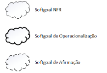
    

    

    Figura 1: Representação dos tipos de softgoals. Fonte: [1].
    

    

    Fonte: [1] - Pág. 31

6. Descreva os quatro tipos de decomposições utilizadas pelo NFR Framework.

    - Decomposição de Softgoal NFR: refina ou subdivide um softgoal NFR em outros específicos. Isso pode ajudar a dividir grandes problemas em problemas menores e oferece um aspecto útil para lidar com ambiguidades e prioridades.
    - Decomposição de Operacionalização: subdivide um softgoal de operacionalização em outros softgoals de operacionalização mais específicos. Operacionalizações são úteis para definir uma solução geral e refiná-la em soluções mais específicas.
    - Decomposição de Afirmação (Claims): refina um softgoal de afirmação em outros softgoals de afirmação. Ela é importante para apoiar ou negar justificativas específicas de projeto.
    - Priorização: A priorização é um tipo especial de decomposição, onde ocorre o refinamento de um softgoal em outro softgoal com o mesmo tipo e tópicos, mas com uma prioridade associada.

    Fonte: [1] - Págs. 32 e 33

7. O que são operacionalizações no NFR e apresente alguns exemplos de possíveis formas de operacionalização de softgoals.

    As operacionalizações definem técnicas de desenvolvimento para que os softgoals NFR sejam alcançados, refinando um softgoal NFR em um softgoal de operacionalização São representados pelos nós folhas do diagrama (SIG).

    Na figura abaixo o softgoal "Implementar Criptografia" é uma forma de operacionalização para implementar uma comunicação segura em um sistema embarcado.
    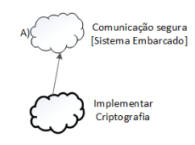
    

    

    Figura 2: Exemplo de softgoal de operacionalização. Fonte: [1]
    

    

    Fonte: [1] - Pág. 33

8. O que são afirmações e apresente a ilustração de possíveis formas de afirmação.

    São utilizadas para refinar os softgoals de afirmação em outros softgoals, ajudam a justificar motivos mais específicos do projeto.

    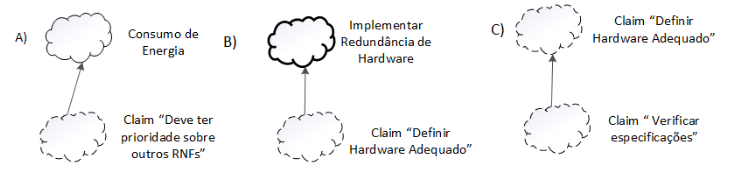

    

    

    Figura 3: Tipos de afirmação. Fonte: [1]
    

    

    Fonte: [1] - Pág. 33

9. O que são contribuições no NFR Framework?

    São uma descrição de como um softgoal descendente contribui para a satisfação do softgoal ascendente.

    Fonte: [1] - Pág. 33

10. Quais são os tipos de contribuições no NFR Framework?

    Os tipos de contribuição são: AND, OR, MAKE, BREAK, HELP, HURT, UNKNOWN, EQUALS e SOME.

    Fonte: [1] - Pág. 34 e 35

11. Apresente um exemplo de contribuição “AND” e “OR”.

    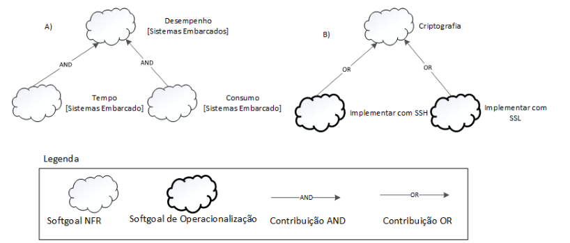
    

    

    Figura 4: Exemplos de contribuição AND e OR. Fonte: [1]
    

    

    Fonte: [1] - Pág. 36

12. Apresente um exemplo de Contribuições "MAKE", "BREAK", "HELP" e "HURT".

    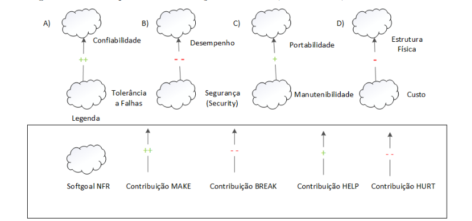

    

    

    Figura 5: Exemplos de contribuição MAKE, BREAK, HELP e HURT. Fonte: [1]
    

    

    Fonte: [1] - Pág. 37

13. Apresente um exemplo de Contribuições "SOME", UNKNOWN e EQUALS

    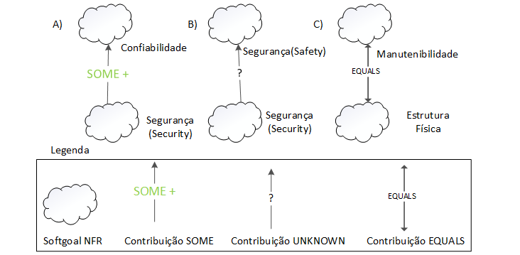
    

    

    Figura 6: Exemplos de contribuição SOME, UNKNOWN e EQUALS. Fonte: [1]
    

    

    Fonte: [1] - Pág. 38

14. O que é procedimento de avaliação?

    O procedimento de avaliação determina o grau que os requisitos não funcionais são satisfeitos por um conjunto de decisões. Dessa forma, o procedimento de avaliação determina se cada softgoal ou interdependência do SIG foi suficientemente satisfeito.

    Fonte: [1] - Pág.38

15. Quais são os tipos de rótulos utilizados pelos softgoals? Como os rótulos são representados nos catálogos?

    São atribuídos rótulos para os softgoals. Os tipos de rótulos utilizados são: satisfeito, fracamente satisfeito, negado, fracamente negado, conflitante, indeterminado.

    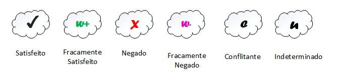
    

    

    Figura 7: Representação dos rótulos no catálogo. Fonte: [1]
    

    

    Fonte: [1] - Pág.

16. Como é feita a análise dos softgoals?

    Parte do nível mais baixo da hierarquia em direção ao nível mais alto, até chegar nos softgoals de nível mais alto do SIG.

    Fonte: [1] - Pág. 38

17. O que é Goal-Oriented Requirements Engineering (GORE)?

    É um paradigma que consiste na evolução do paradigma da Orientação a Objetos. Esse paradigma preocupa-se com o uso das metas para elicitação, elaboração, estruturação, especificação, análise, negociação, documentação e modificação dos requisitos.

    Fonte: [2] - Pág. 4

18. Explique a propagação de Impactos apresentada na página 19 dos Slides da aula 17.

    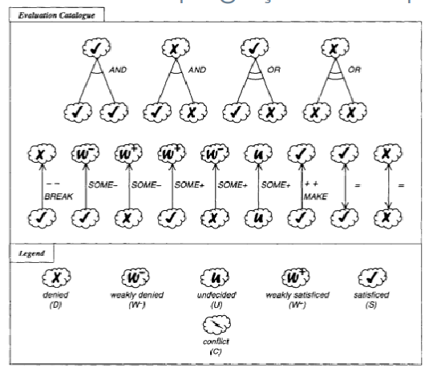
    

    

    Figura 8: Propagação de impactos. Fonte [2].
    

    

    Na Figura 8 está representado um NFR após a avaliação. A propagação de impactos consiste na análise do que ocorrerá com os softgoals ascendentes caso os descendentes não sejam satisfeitos, e essa análise é feita a partir do tipo de contribuição entre eles. Por exemplo, na primeira ilustração temos um softgoal com dois descentes com contribuição AND, o ascendente só será satisfeito se ambos descendentes o forem. Caso um deles não seja, como na figura seguinte, então o ascendente também não será. O mesmo ocorre para a operação OR, onde faz-se o OU lógico entre os softgoals descendentes.

    Na segunda linha temos os outros tipos de contribuição, caso a contribuição seja BREAK, se o descendente for satisfeito, o ascendente não será. Na contribuição SOME-, caso o descendente seja satisfeito, o ascendente será fracamente negado (W-). A mesma lógica é aplicada às outras contribuições, como por exemplo o SOME+ determina que o ascendente será fracamente satisfeito, e se a relação for EQUALS, opera-se um igual lógico.

    Fonte: [2] - Pág. 19

19. Apresente um exemplo de propagação de Impactos.

    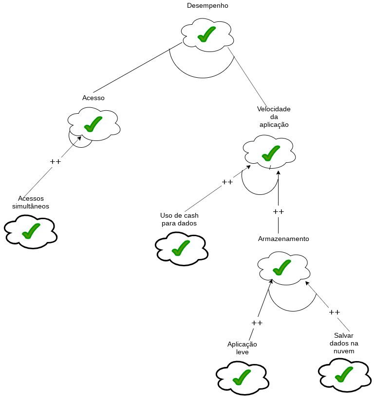
    

    

    Figura 9: Exemplo de propagação de Impactos. Fonte: [3]
    

    

    Na Figura 9 está um exemplo da propagação de impactos.

    Fonte: [3]

20. Apresente algumas telas de ferramentas para montar um catálogo do NFR Framework. (Faça uns prints das telas do StarUML, OME etc.)
    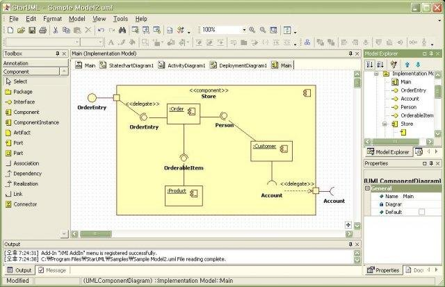
    

    

    Figura 10: Tela da ferramenta StarUML. Fonte: [4]
    

    

    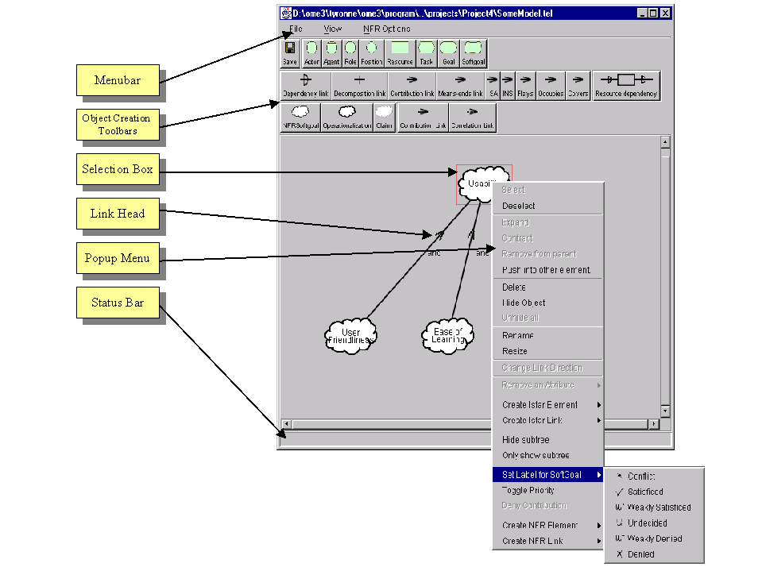

    

    

    Figura 11: Tela da ferramenta OME. Fonte: [5]
    

    

## Bibliografia

[1] Silva, Reinaldo Antônio da NFR4ES: um Catálogo de Requisitos Não-Funcionais para Sistemas Embarcados/ Reinaldo Antônio da Silva – 2019.

[2] SERRANO M., SERRANO M. [Requisitos - Aula 17](https://aprender3.unb.br/pluginfile.php/2307541/mod_resource/content/1/Requisitos%20-%20Aula%20019a.pdf)

[3] Projeto Duolingo - Requisitos de Software. [NFR Framework](https://requisitos-de-software.github.io/2019.2-Duolingo/modelagem/NFR/)

[4] [Manual de uso da plataforma OME.](http://www.cs.toronto.edu/km/ome/docs/manual/manual.html)

[5] [Manual de uso da plataforma StarUML.](https://staruml.sourceforge.net/v1/modules.php)
