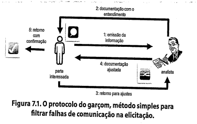

# Apresentação do livro

- Poucos projetos de software conseguem entregar todas as capacidades que todos os _stakeholders_ querem na primeira data de entrega;
- Todo projeto com limitação de recursos precisa definir as prioridades relativas das funcionalidades solicitadas;
- Aqui entra a priorização, ou triagem dos requisitos, que é usada para resolver conflitos, revelar objetivos conflitantes e planejar entregas, escopo e fazer as decisões de trade-off.

## Por que priorizar requisitos?

- A priorização é uma forma de lidar com demandas concorrentes com recursos limitados;
- Como a priorização é relativa, ela pode ser iniciada a partir do momento em que houverem dois requisitos;
- Às vezes clientes não gostam de priorizar requisitos, por acharem que os que tiverem baixa prioridade não serão entregues;
- Às vezes os desenvolvedores não gostam de priorizar requisitos por que isso gera a impressão de que eles não darão conta de desenvolver tudo;
- Ambos estão certos, não é possível entregar todas as funcionalidades de primeira, e a priorização ajuda a maximizar o valor de negócio do projeto o mais rápido possível dentro das restrições do projeto;

- Priorização é uma estratégia crítica para projetos ágeis, ou que desenvolvam produtos por meio de uma série de períodos de tempo fixados;
- Etapas da priorização:
  - O time do projeto pode popular o backlog com histórias de usuário, funcionalidades, processos defeitos a serem resolvidos.
  - Os clientes priorizam as histórias do backlog e selecionam quais eles querem implementadas em cada iteração do desenvolvimento;
  - Os desenvolvedores fazem uma estimativa de esforço necessário e estimam quantas histórias podem ser resolvidas em cada iteração, baseado na capacidade de entrega, medida pela velocidade do time;
  - A medida que novas histórias surgem, os clientes determinam suas prioridades em relação ao que já está presente no backlog, ajustando o escopo das iterações seguintes de forma dinâmica;
- Em cada projeto, o gerente deve balancear o escopo desejado do projeto em relação às restrições de tempo, dinheiro, pessoal e qualidade desejada;
- Esse gerenciamento pode ser feito deixando de lado ou abrindo mão de requisitos de baixa prioridade, a medida que surgem requisitos mais essenciais ou ocorrem mudanças nas condições do projeto;
- A priorização é um processo dinâmico que ocorre **durante** o projeto;
- Caso o cliente não consiga fazer a priorização dos requisitos, os gerentes do projeto devem tomar essas decisões por conta própria;
- A priorização de requisitos é pautada em uma boa comunicação entre o cliente e a equipe de desenvolvimento, e essa priorização ajuda a clarear as expectativas do cliente.

# Lista de exercícios

## 1. O que é elicitar requisitos?

- É um processo de aquisição de conhecimentos, onde se aplicam técnicas para compreender melhor o negócio a ser impactado pelo projeto, para identificar partes interessadas e para identificar e refinar os tipos de requisitos.
- A elicitação gera as memórias de levantamento, que documentam o conhecimento adquirido.

## 2. Escreva sobre as sub-atividades da elicitação

### Preparação

- Garantir que todos os recursos necessários estejam organizados e reservados para sua realização.
- Definir as técnicas que serão utilizadas.

### Execução

- Levantar o maior número possível de informações.
- Captar, também, os atributos dos requisitos.
- Tomar atenção aos requisitos implícitos: desejos não manifestos pela parte interessada.

### Documentação

- É importante para que a informação não se perca;
- O conhecimento adquirido na elicitação possa ser compartilhado com os membros da equipe;
- Outras pessoas possam dar sequência à análise de requisitos;
- Confirmar com as partes interessadas o entendimento sobre os requisitos;
- O documento deve conter: destaque dos tópicos discutidos, decisões tomadas, questões não resolvidas, ações acordadas e prazos limites, pessoas responsáveis por cada ação, data do próximo encontro.

### Confirmação

- Falhas de comunicação podem ser evitadas por meio da confirmação.
- O protocolo do garçom visa minimizar as falhas na comunicação.

- Para evitar que os documentos fiquem sem resposta da confirmação é importante definir datas limite.

## 3. Quais são as técnicas mais utilizadas para elicitar requisitos?

- **Análise de documentos**: elicitar requisitos pelo estudo de documentação disponível sobre uma solução existente para identificação de informação relevante para o desenvolvimento de uma nova solução (exemplos: planos de negócio, literatura de marketing, acordos, fluxos de processos atuais e etc.)
- **Glossário**
- **Observação**
- **Entrevista**
- **Pesquisa/Questionário**

## 4. Descreva a técnica de Brainstorming para elicitar requisitos? Quem participa dessa técnica?

## 5. Descreva a técnica de Storytelling para elicitar requisitos? Quem participa dessa técnica?

## 6. Descreva a técnica de Entrevista para elicitar requisitos? Quem participa dessa técnica?

## 7. Descreva a técnica de Questionário para elicitar requisitos? Quem participa dessa técnica?

## 8. Descreva a técnica de Observação para elicitar requisitos? Quem participa dessa técnica?

Por que não assistir o trabalho sendo realizado pela pessoa em vez de perguntar sobre ele? Esse é objetivo da observação de campo ou etnografia. Essa técnica tem sua origem na antropologia.

### Preparação

Estabelecer objetivos, selecionar o grupo de pessoas e janela de tempo adequada.

Necessidades de informação: **Escopo** e **Profundidade** das tarefas realizadas.

Deve determinar-se quais:

- questões de buscam responder durante ou após a observação.
- usuários cujo trabalho deve ser observado.
- atividades a observar.
- momentos para realizar a observação.
- postura: passiva (invisível) ou ativa (visível).

### Execução

O analista:

- Apresenta-se às pessoas que serão observadas;
- Assegura a essas pessoas que seu trabalho não sera criticado;
- Comunica que sua presença é apenas para estudar seus processos;
- Pode sugerir que os observados "pensem alto" enquanto trabalham.

Se a abordagem de observação for ativa, deve-se perguntar questões exploratórias sobre a maneira de execução das tarefas e processos observados.

## 9. Descreva a técnica de Introspecção para elicitar requisitos? Quem participa dessa técnica?

## 10. Descreva a técnica de Análise de Protocolo para elicitar requisitos? Quem participa dessa técnica?

## 11. Descreva a técnica de Análise de Discurso para elicitar requisitos? Quem participa dessa técnica?

## 12. Descreva a técnica de Entrevista para elicitar requisitos? Quem participa dessa técnica?

A entrevista é uma forma de diálogo, formal ou informal. O entrevistador realiza perguntas previamente planejadas.

## 13. Descreva a técnica de grupos de foco para elicitar requisitos? Quem participa dessa técnica?

## 14. Descreva a técnica de investigação contextual para elicitar requisitos? Quem participa dessa técnica?

## 15. O que é priorizar requisitos?

## 16. Descreva a técnica MoSCoW para priorizar requisitos? Quem participa dessa técnica?

## 17. Descreva a técnica First Things First para priorizar requisitos? Quem participa dessa técnica?

## 18. Descreva a técnica ROI para priorizar requisitos? Quem participa dessa técnica?

## 19. Descreva a técnica QFD para priorizar requisitos? Quem participa dessa técnica?

## 20. Escolha uma técnica para elicitar requisitos e explique como ela poderia ser utilizada para elicitar requisitos sobre o app que você elaborou o RichPicture
