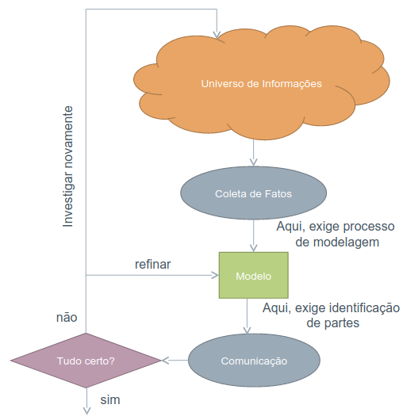

# Verificação e Validação

1. Teste é a única maneira de analisar um software a procura de defeitos?

    Não, os defeitos podem ser identificados em qualquer etapa, por meio da verificação e validação.

    Fonte: [1]

2. Quais são os produtos que podem ser analisados pela Verificação e Validação?

    Modelos, códigos, casos de testes e qualquer artefato elaborado.

    Fonte: [1]

3. O que é uma análise estática e análise dinâmica?

    Análise estática é feita sem execução de código, como por exemplo revisão de código. Já a análise dinâmica exige execução de código, como por exemplo testes caixa preta.

    Fonte: [1]

4. O que é verificação?

    Garantir que os produtos de trabalho selecionados cumpram os seus requisitos especificados. Esses requisitos podem ser requisitos de software, condições, padrões, práticas e convenções, por exemplo.

    Fonte: [1]

5. Cite alguns exemplos de verificação.

    É possível fazer a revisão de requisitos com ferramentas de module checking para verificar se os requisitos são verificáveis.

    Fonte: [1]

6. O que pode ser verificado?

    Qualquer artefato criado durante o projeto, além de manuais e código, por exemplo.

    Fonte: [1]

7. Por que na implementação a integração contínua e verificação por pares são considerados Verificação?

    Na integração contínua o código é verificado durante a integração, porque os novos trechos de código devem se adequar ao padrão existente. Na programação por pares um par naturalmente revisa o código do outro.

    Fonte: [1]

8. O que é validação?

    Demonstrar que o produto ou componente do produto cumpre o uso pretendido quando colocado em seu ambiente desejado. Ou seja, é verificar se ele atende as necessidades dos stakeholders, e por isso exige participação dos stakeholders.

    Fonte: [1]

9. Cite exemplos de validação no processo de desenvolvimento de software.

    A validação pode ser feita por meio de protótipos, por exemplo.

    Fonte: [1]

10. Na empresa CODUS Tecnologia, quais são os três processos de verificação?

    Code review, testes automatizados, análise estática do código e pair programming.

    Fonte: [1]

11. Na empresa CODUS Tecnologia, quais são os três processos de validação?

    Wireframes (protótipos) são usados durante a especificação, no ciclo de interação é realizado teste em ambiente local, depois o teste é feito no ambiente de homologação e por fim as funcionalidades passam para o ambiente de produção.

    Fonte: [1]

12. O que é revisão?

    É uma forma de avaliar um produto em busca de defeitos. Verificar se o produto avaliado está de acordo com os padrões definidos.

    Fonte: [2]

13. Cite exemplos de revisão estática e revisão dinâmica?

    Revisões são geralmente estáticas, pois não exigem a execução do produto. Mas podem ser dinâmicas, como por exemplo testes de usabilidade.

    Fonte: [2]

14. O que é amplificação de defeitos?

    De uma etapa para a seguinte um defeito causará novos defeitos, por exemplo, um requisito mal formulado na etapa de especificação pode resultar em uma funcionalidade incompleta nas etapas de implementação.

    Fonte: [2]

15. Quais as vantagens de desenvolver um software com revisão?

    A revisão aumenta a quantidade de defeitos corrigidos antes de avançar as etapas do projeto, diminuindo o retrabalho.

    Fonte: [2]

16. Testes são mais eficazes para?

    Artefatos que já estão completos, identificar defeitos relacionados à integração entre componentes, como questões de temporização e desempenho.

    Fonte: [2]

17. Quais as desvantagens de desenvolver um software com revisão?

    Aumenta o custo do projeto, pois envolve recursos humanos. É necessário levar em conta o fator humano envolvido, pois a revisão consiste em corrigir defeitos em artefatos criados por outras pessoas, e a exposição pública desses defeitos pode gerar desconfortos.

    Fonte: [2]

18. Qual a maneira para provar que a revisão é uma vantagem?

    Montar um histórico dos defeitos encontrados sem e com a revisão.

    Fonte: [2]

19. Quais são os tipos de revisão?

    Existem dois tipos de revisão, informal e formal. O primeiro consiste em revisões sem um planejamento bem definido, não exige preparação nem acompanhamento posterior, como por exemplo programação em pares. As revisões formais são realizadas por pequenos grupos e seguem um formato geral.

    Fonte: [2]

20. Explique como devem ser realizadas as revisões formais?

    As revisões formais geral englobam atividades de pré-revisão, como planejamento e análise individual do artefato, reunião da revisão e atividades pós-revisão para acompanhar os problemas encontrados.

    Fonte: [2]

21. Quais são os tipos de revisão formais?

    De acordo com a IEEE 1028, os tipos de revisão são:

    - Revisões gerenciais
    - Revisões técnicas
    - Inspeção
    - Walkthrough
    - Auditoria

    Fonte: [2]

22. Explique o processo de Inspeção.

    É uma técnica de revisão formal, proposta por Fagan em 1976. Surgiu de várias formas de revisão realizados por ele, e foi proposta inicialmente para código.

    Fonte: [2]

23. Quais são as características principais da Inspeção?

    Usa checklists de erros mais comuns, classifica os defeitos encontrados, há uma ênfase maior na preparação e a leitura do artefato, durante a reunião de revisão, não é feita pelo autor. Nela não são feitas sugestões para resolver os defeitos.

    Fonte: [2]

24. Em que consiste a atividade de Análise de Requisitos?

    A análise de requisitos usa pessoal, métodos e ferramentas para fazer identificação de partes, verificação e validação e depende de pontos de vista.

    Fonte: [3]

25. Apresente o Loop da Análise de Requisitos.

    O loop da análise de requisitos (Figura 1) consiste na transformação de um universo de informações em comunicação, passando pelas etapas de coleta de fatos, modelagem e refinação.

    
    

    

    Figura 1: Loop da Análise de Requisitos. Fonte: [3]
    

    

    Fonte: [3]

26. Qual são as técnicas para coletar fatos? Explique cada um deles.

    Podem ser usadas técnicas como:

    - Leitura de documentos: acesso a documentação em linguagem natural, como resoluções e normas.
    - Observação: o engenheiro de requisitos observa, de forma passiva, o ambiente no qual o software irá atuar.
    - Entrevistas: o engenheiro de requisitos elabora, a partir dos conhecimentos sobre o problema, um conjunto de perguntas.
    - Questionários: usado para colher dados de um grande número de clientes.
    - Análise de protocolos: analisando o trabalho de alguém por meio da verbalização desse alguém.
    - Participação ativa dos atores: uso de clientes reais no processo de modelagem.
    - Enfoque antropológico: o engenheiro de requisitos pode se integrar ao universo de informações para obter um conhecimento mais amplo do problema.
    - Reuniões: podem ser feitas de diversas maneiras, é importante proporcionar a cooperação entre os participantes.
    - Reutilização: é importante reutilizar dados já coletados, usados na construção de outros produtos.
    - Recuperação do desenho de software: esse processo consiste no estudo de produtos de software disponíveis na própria organização, e isso pode ser feito por meio da engenharia reversa.

    Fonte: [3]

27. Quais aspectos devem ser observados na comunicação?

    - Apresentação: ser claro e compreensível ao apresentar as informações.
    - Linguagem: conhecer a linguagem do cliente facilita a comunicação.
    - Nível de Abstração: usar um nível mais alto quando os clientes não possuem conhecimento técnico, para que o cliente se sinta confortável.
    - Retroalimentação: para melhorar a passagem da informação é aconselhável estimular o receptor a recolocar o que foi comunicado até que se perceba uma compreensão por parte dele.

    Fonte: [3]

28. O que é identificação de partes?

    Para analisar é necessário conhecer o modelo objeto da análise. A tarefa de identificação de partes consiste na identificação das fontes de informação. Além de identificar as partes, é importante conhecer os elos de ligação entre essas partes e as fontes de informação. A pré-rastreabilidade consiste em manter o rastro entre as partes identificadas e as fontes de informação.

    Fonte: [3]

29. Quais são os seis passos do método de inspeção proposto por Fagan?

    Os passos são planejamento, visão geral, preparação, inspeção, correção e acompanhamento.

    Fonte: [3]

30. Cite algumas estratégias de validação de software?

    São estratégias de validação de software a comprovação informal, prototipagem e análise de pontos de vista.

    Fonte: [3]

31. O que é a estratégia de comprovação informal?

    É uma tarefa de leitura das descrições em linguagem natural e uso dos clientes para identificar problemas na expressão dos requisitos.

    Fonte: [3]

32. O que é a estratégia de prototipação?

    Consiste em apresentar algum tipo de protótipo para validar os requisitos e especificações com base na expectativa do usuário.

    Fonte: [3]

33. O que é teste de software?

    É o processo de executar programas utilizando casos de teste, com o objetivo de encontrar defeitos, em um ambiente controlado.

    Fonte: [3]

34. Em que consiste de um bom teste de software?

    Um bom teste deve ter alta probabilidade de encontrar um erro, não ser redundante e não deve ser muito simples nem muito completo.

    Fonte: [3]

35. Escolha uma estratégia de verificação e explique como utilizar essa estratégia para verificar um artefato do seu projeto.

    É possível utilizar a inspeção para verificar os artefatos elaborados. Abaixo, o planejamento para execução da inspeção.

    | Etapa | Atividades
    | - | - |
    | Planejamento | <ol> <li> Definição do artefato <ul> <li> Framework NFR </ul> <li>  Definição do avaliador <ul><li> Nicolas  </ul> <li>  Definição dos critérios  (checklist) <ul><li>Critérios do plano de ensino, observações do professor durante as apresentações e feedback dos monitores</ul> <li> Definição do cronograma <ul><li> Verificação e correção: 05/01/23 </ol>
    | Visão geral | Durante a avaliação o avaliador deve verificar se o artefato cumpre cada item do critério utilizado.
    | Preparação | Leitura individual do artefato juntamente com os autores e revisores.
    | Inspeção | Após a leitura do artefato, fazer a varredura do texto em busca de defeitos registrando-os em um relatório.
    | Correção | Ao registrar os defeitos encontrados, registrar também uma proposta de correção. Ao final, repassar aos autores e revisores as considerações feitas para que eles possam fazer as correções.
    | Acompanhamento | Validar as correções feitas com os monitores.

36. Escolha uma estratégia de validação e explique como utilizar essa estratégia para validar um requisito do seu projeto.

    A validação pode ser feita por meio da prototipação. Considerando que o sistema já está em produção, podemos escolher um requisito que ainda não seja atendido pelo sistema, como por exemplo a possibilidade de jogar várias partidas ao mesmo tempo, e então elaborar um protótipo de baixa fidelidade, como o protótipo de papel, para validar as necessidades com o usuário.

## Bibliografia

[1] Gerência e Qualidade de Software - Aula 05 - Verificação e Validação – UNIVESP 
[2] Gerencia e Qualidade de Software - Aula 06 - Técnica de revisão – UNIVESP 
[3] SERRANO M., SERRANO. M. Slides: Requisitos - Aula 23. 
